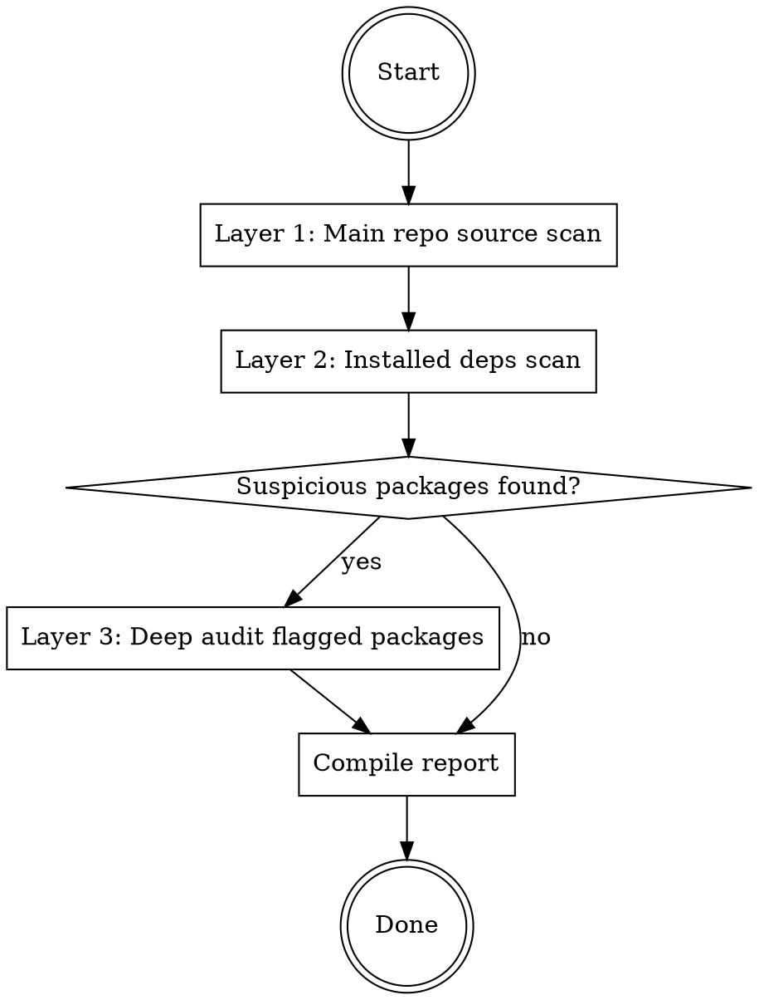

# Security Audit for Third-Party Code

## Overview

Systematic security audit of third-party codebases to detect backdoors, malware, credential theft, and supply chain attacks **before** the code runs in any environment with access to sensitive data (private keys, mnemonics, API keys, credentials).

**Core principle:** Assume hostile intent. Every file, dependency, and build hook is suspect until proven clean.

## Default Behavior (No Arguments)

If this skill is invoked **without any arguments or prompt** (e.g., user just types `/security-audit` with no target specified), **audit the current working directory's project**:

1. **L1: Scan the project source code** in the current directory for all threat patterns (Phases 1–6)
2. **L2: Scan the project's supply chain dependencies** — detect ecosystem (Cargo.toml → Rust, package.json → Node.js, requirements.txt/pyproject.toml → Python), safely download dependency source code, and scan them
3. **L3: Deep audit** any dependencies flagged as suspicious in L2

Do NOT ask the user what to audit — just proceed with the current directory. This is the expected behavior when no explicit target is given.

## Target Argument Handling

If invoked **with a target argument** (e.g. `/security-audit <github-url>`):

- **GitHub URL or `owner/repo`**: clone into a fresh temp directory, then run the full audit (L1 → L2 → L3) there:

  ```bash
  AUDIT_DIR="$(mktemp -d)" && git clone <url> "$AUDIT_DIR/repo" && cd "$AUDIT_DIR/repo"
  ```

  - Never clone into the current project directory.
  - Submodules are not fetched by default — keep it that way. `.gitmodules` is itself an audit target; never run `git submodule update --init` before reviewing it.
  - **After cloning, execute nothing from the repo** except the safe-download commands defined below (`npm install --ignore-scripts` / `cargo vendor` / `pip download`). Audit first, install later — always.
- **Local path**: audit that directory directly, no cloning.

Record the audited commit SHA (`git rev-parse HEAD`) in the report header — the verdict is pinned to that revision.

## When to Use

- Cloned a GitHub repo and want to verify it's safe before running
- Evaluating a new npm package, Rust crate, or Python package
- Auditing dependencies of a project you already use
- Reviewing code that will run in an environment with private keys or credentials
- After a dependency update that introduced unfamiliar packages

## When NOT to Use

- Reviewing your own code for bugs (use code-review)
- General code quality review (use simplify)
- Known CVE scanning only (use `npm audit` / `cargo audit` / `pip-audit` directly)

## Audit Strategy: Layered Approach



| Layer | Scope | Cost | Coverage |
|-------|-------|------|----------|
| **L1: Main repo** | Project source code only | Low | Direct threats |
| **L2: All deps** | `node_modules/` or `vendor/` or extracted packages | Medium | Supply chain attacks |
| **L3: Flagged only** | Deep-dive suspicious packages from L2 | High | Targeted review |

**Default:** Always do L1 + L2. Do L3 only for packages flagged in L2.

## Safe Dependency Download (CRITICAL — Do This First)

**The goal: get dependency source code locally WITHOUT executing any of it.**

### Node.js / TypeScript

```bash
# SAFE: install deps but block all lifecycle hooks
npm install --ignore-scripts
# Now node_modules/ is populated but no postinstall ran
```

### Rust

```bash
# SAFE: download all dep source to vendor/, no compilation
cargo vendor
# Now vendor/ has all crate source code
# WARNING: do NOT run cargo build until audit is complete — build.rs executes at compile time
```

### Python

```bash
# SAFE: download packages without installing
pip download -r requirements.txt -d ./pip_packages --no-deps
# Then extract and scan
cd pip_packages && for f in *.tar.gz; do tar xzf "$f"; done && for f in *.whl; do unzip -q "$f" -d "${f%.whl}"; done
```

## Phase 1: Surface Scan

Quick triage to catch obvious red flags.

**Check:**
- Project age, stars, forks, last commit (too new + too few = higher risk)
- Binary files that shouldn't be there (`.so`, `.dll`, `.dylib`, `.wasm` in unexpected places)
- Minified/bundled JS in source (not in `dist/`) — could hide anything
- Unusual hidden files (`.bashrc`, `.profile` in repo root)

**Commands:**
```bash
# Binary files
find . -type f \( -name "*.so" -o -name "*.dll" -o -name "*.dylib" -o -name "*.wasm" -o -name "*.bin" \) -not -path "*/node_modules/*" -not -path "*/vendor/*" -not -path "*/target/*"

# Minified JS in source
find . -name "*.min.js" -not -path "*/node_modules/*" -not -path "*/dist/*" -not -path "*/build/*" -not -path "*/vendor/*"

# Suspicious hidden files
find . -maxdepth 2 -name ".*" -not -name ".git" -not -name ".gitignore" -not -name ".env.example" -not -name ".eslintrc*" -not -name ".prettierrc*" -not -path "*/.git/*"
```

## Phase 2: Build Hook & Lifecycle Audit

**These are the #1 attack vector — code that runs automatically.**

### Node.js: package.json scripts

```
Grep in all package.json files (including node_modules):
  "preinstall"|"postinstall"|"prepare"|"prebuild"

# Focus on postinstall that make network calls or execute binaries
Grep in node_modules/*/package.json:
  "postinstall"
# Then read each matched postinstall script
```

### Rust: build.rs

```bash
# List ALL build.rs files in vendor
find vendor/ -name "build.rs" -type f

# Check build.rs for dangerous operations
grep -rn "Command::new\|std::net\|TcpStream\|reqwest\|curl\|std::fs::write\|std::env::var" vendor/*/build.rs
```

### Rust: proc_macro crates

```bash
# These execute at COMPILE TIME — treat as build hooks
grep -rl 'proc-macro\s*=\s*true' vendor/*/Cargo.toml
# Then review each proc_macro crate's lib.rs
```

### Python: setup.py

```
Grep in setup.py files:
  cmdclass|install_requires.*subprocess|os\.system|exec\(|eval\(
```

## Phase 3: Sensitive API Scan

Search for dangerous API usage across main source AND dependency directories.

### File System — Reading Sensitive Paths

```
Grep patterns (case-insensitive) in *.js, *.ts, *.rs, *.py:
  \.env[^.]
  \.ssh
  keystore|wallet\.dat
  \.aws/credentials
  \.gnupg|id_rsa
  \.kube/config
```

### Process & Environment

```
# Node.js
  process\.env(?!\.NODE_ENV|\.PATH|\.HOME|\.CI)   # Exclude common benign ones
  child_process|exec\(|execSync|spawn\(

# Rust
  std::env::var(?!.*"PATH"|.*"HOME"|.*"CARGO")
  std::process::Command

# Python
  os\.environ|os\.getenv
  subprocess\.|os\.system\(|os\.popen\(
```

### Eval & Dynamic Code Execution

```
# Node.js
  eval\(|new Function\(|vm\.runIn
  require\([^"'][^)]*\)    # dynamic require (variable, not string literal)
  import\([^"'][^)]*\)     # dynamic import

# Rust
  include_str!\(|include_bytes!\(   # compile-time file embedding
  dlopen|libloading              # dynamic library loading

# Python
  eval\(|exec\(|compile\(|__import__\(
```

## Phase 4: Crypto & Key Patterns

**Most critical phase for crypto/DeFi environments.**

### Private Key & Mnemonic Detection

```
Grep patterns (case-insensitive):
  private.?key|secret.?key|signing.?key
  mnemonic|seed.?phrase
  keystore|wallet
  0x[0-9a-fA-F]{64}          # Raw hex private key

# Ethers.js / web3 specific
  new Wallet\(|ethers\.Wallet
  privateKeyToAccount
  from_key|from_mnemonic|SigningKey

# Rust crypto
  SecretKey::from_slice|SigningKey::from_bytes
```

### Clipboard & Keylogger

```
  clipboard|pbcopy|pbpaste|xclip|xsel
  navigator\.clipboard
  keydown|keyup|keypress|keyboard\.on
```

## Phase 5: Network Exfiltration

### Outbound Network Calls

```
# Node.js
  fetch\(|axios\.|http\.request|https\.request
  WebSocket\(|net\.connect|dgram\.createSocket

# Rust
  reqwest::|hyper::Client|TcpStream::connect|UdpSocket
  surf::|isahc::|ureq::

# Python
  requests\.|urllib|httpx\.|aiohttp
  socket\.connect|socket\.create_connection

# DNS exfiltration (all languages)
  dns\.resolve|dns\.lookup|getaddrinfo
```

### Hardcoded Suspicious Endpoints

```
  https?://[0-9]{1,3}\.[0-9]{1,3}\.[0-9]{1,3}\.[0-9]{1,3}   # IP addresses
  https?://[a-z0-9]+\.(xyz|tk|ml|ga|cf|top|icu|buzz)          # Suspicious TLDs
  \.onion|\.i2p                                                  # Dark web
  pastebin\.com|hastebin|transfer\.sh|webhook\.site              # Data drop sites
```

### Exfiltration Prep (encoding before send)

```
  btoa\(|Buffer\.from.*base64|base64::encode
  encodeURIComponent\(.*(?:key|secret|private|mnemonic)
  JSON\.stringify.*(?:key|secret|private|mnemonic)
```

## Phase 6: Obfuscation Detection

**Obfuscated code in source (not dist/) is a major red flag.**

### Encoding Tricks

```
  \\x[0-9a-f]{2}                      # Hex-escaped strings
  \\u[0-9a-f]{4}                      # Unicode-escaped
  String\.fromCharCode\(|fromCharCode.*apply
  atob\(["'][A-Za-z0-9+/=]{20,}       # Long inline base64
  Buffer\.from\(["'][A-Za-z0-9+/=]{20,}.*base64
```

### Dynamic Code Construction

```
  \["con"\s*\+\s*"structor"\]          # Hidden constructor access
  window\[.*\]|global\[.*\]|globalThis\[.*\]
  Reflect\.apply|Reflect\.construct
  Object\.getPrototypeOf.*constructor
```

### Long Lines (potential encoded payloads)

```bash
# Source files with lines > 500 chars (excluding dist/build/vendor/node_modules)
awk 'length > 500 {print FILENAME ":" NR}' $(find . -name "*.js" -o -name "*.ts" -not -path "*/node_modules/*" -not -path "*/dist/*" -not -path "*/build/*" -not -path "*/vendor/*")
```

## Severity Classification

| Severity | Criteria | Action |
|----------|----------|--------|
| **CRITICAL** | Active exfiltration of keys/credentials; obfuscated malicious payload; known malware patterns | **Do NOT use. Report to registry.** |
| **HIGH** | Reads sensitive env/files + makes network calls (exfil capability); suspicious build hooks with network access; heavily obfuscated source | **Do not use without thorough manual review.** |
| **MEDIUM** | Accesses env vars without clear necessity; makes network calls to unusual endpoints; unnecessary filesystem permissions | **Review each finding. May be legitimate.** |
| **LOW** | Uses eval for legitimate purposes (template engines); reads files within expected scope; standard API calls | **Note and verify. Usually acceptable.** |
| **CLEAN** | No suspicious patterns across all phases | **Likely safe, but no audit is 100%.** |

## Report Template

```markdown
# Security Audit Report: [project-name]

## Summary
- **Risk Level:** CRITICAL / HIGH / MEDIUM / LOW / CLEAN
- **Recommendation:** DO NOT USE / USE WITH CAUTION / SAFE
- **Ecosystem:** Node.js / Rust / Python
- **Audited Commit:** [commit SHA]
- **Audit Layers Completed:** L1 + L2 [+ L3 for: package-x, package-y]

## Critical Findings
- [finding with file:line reference and severity]

## Build Hook Analysis
- Lifecycle hooks found: yes/no (list packages)
- build.rs / proc_macro crates found: N (list)
- Dangerous operations in hooks: [details]

## Dependency Summary
- Total dependencies: N
- With lifecycle hooks: N
- Suspicious: N (list)
- Flagged for L3 review: N (list)

## Phase Results
| Phase | Status | Findings |
|-------|--------|----------|
| 1. Surface Scan | done | [summary] |
| 2. Build Hooks | done | [summary] |
| 3. Sensitive APIs | done | [summary] |
| 4. Crypto/Key Patterns | done | [summary] |
| 5. Network Exfiltration | done | [summary] |
| 6. Obfuscation | done | [summary] |
```

## Common False Positives

| Pattern | Why it's usually benign |
|---------|------------------------|
| `process.env.NODE_ENV` | Standard environment check |
| `fetch()` in HTTP client libs | That's their stated purpose |
| `eval()` in template engines | Expected functionality |
| `fs.readFile` in build tools | Build tools read project files |
| `child_process` in CLI tools | CLI tools run subprocesses |
| `std::process::Command` in build tools | Build orchestration |
| `build.rs` with `cc` crate | C compilation — legitimate but verify |
| `unsafe` in FFI bindings | Necessary for C interop — but review scope |

**Key distinction:** Is the sensitive API usage **expected** for the library's stated purpose? A math library reading `process.env.PRIVATE_KEY` is not expected.

## Important Caveats

- **No audit is 100%.** Sophisticated attacks can evade pattern matching.
- **Context matters.** A web framework legitimately makes HTTP calls. A math library should not.
- **Compile = execute for Rust.** Never `cargo build` before auditing `build.rs` and proc_macros.
- **npm install = execute.** Always use `--ignore-scripts` first.
- **Audit on update.** A clean v1.0 doesn't guarantee a clean v1.1.
- **Published ≠ source.** npm/PyPI published code may differ from GitHub source.
